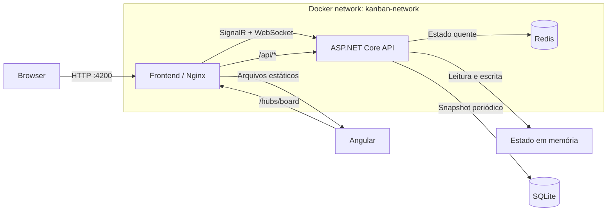
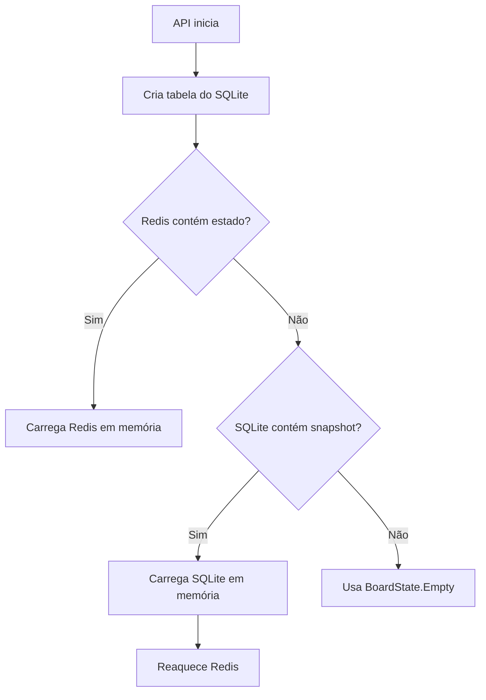

# Arquitetura do KanbanBoard

## Objetivo

O KanbanBoard é uma aplicação cliente-servidor para organização visual de trabalho. A interface Angular não mantém uma cópia persistente própria: a API ASP.NET Core é a fonte da verdade e distribui o estado atualizado aos clientes conectados por SignalR.

A arquitetura combina três formas de armazenamento com responsabilidades diferentes:

- memória da API para acesso e mutação imediatos;
- Redis para manter o estado quente e recuperá-lo rapidamente;
- SQLite para snapshots duráveis sem um servidor adicional de banco de dados.

## Visão geral



No navegador, todas as chamadas usam a mesma origem `http://localhost:4200`. O Nginx encaminha `/api` e `/hubs` ao serviço `api:8080` pela rede Docker. Isso elimina a necessidade de o browser conhecer nomes internos dos containers.

## Containers

| Serviço | Responsabilidade | Porta interna | Porta no host | Persistência |
| --- | --- | ---: | ---: | --- |
| `frontend` | Servir o bundle Angular e atuar como proxy reverso | `8080` | `4200` | Nenhuma |
| `api` | Regras de negócio, estado e comunicação em tempo real | `8080` | `5080` | Volume `api-data` |
| `redis` | Cache quente do estado completo | `6379` | `6379` | Volume `redis-data` |

Os serviços compartilham a rede bridge `desafio-pl_kanban-network`. Os healthchecks determinam a ordem de inicialização: Redis saudável, depois API saudável e, por último, frontend.

## Backend

### Inicialização e composição

O arquivo `backend/Kanban.Api/Program.cs` é o composition root. Ele:

1. configura CORS para execução sem o proxy Docker;
2. registra `BoardStore`, `RedisBoardCache` e `BoardSnapshotWorker`;
3. registra o SignalR;
4. expõe `/health`, `/api/board` e `/hubs/board`;
5. inicializa o armazenamento antes de aceitar o fluxo normal da aplicação.

### Domínio

`BoardModels.cs` contém o estado e os contratos de comandos. O estado atual possui:

```text
BoardState
├── Version
├── Columns[]
└── Tasks[]
    └── Checklist[]
```

`BoardReducer.cs` concentra regras puras de transformação. Cada operação recebe o estado atual e devolve um novo estado:

- `AddColumn` valida título e tipo;
- `AddTask` valida coluna, status e checklist;
- `MoveTask` move e normaliza posições das lanes;
- `ToggleChecklist` altera somente o item solicitado.

Por não acessar Redis, SQLite, SignalR ou relógio externo, o reducer permanece simples de testar e reutilizar.

### Coordenação de estado

`BoardStore.cs` é o ponto único de leitura e mutação do quadro dentro da API.

- O estado fica em memória durante a execução.
- Um `SemaphoreSlim` serializa mutações concorrentes na instância.
- Cada comando passa pelo `BoardReducer`.
- Depois da mutação, o estado completo é enviado ao Redis.
- A flag `dirty` indica que existe uma versão ainda não gravada no SQLite.

O método `Get()` entrega a fotografia atual. Os métodos de comando não expõem os detalhes de persistência ao hub.

### Tempo real

`BoardHub.cs` é a fronteira SignalR.

- Ao conectar, o cliente recebe `BoardChanged` com o estado atual.
- A UI invoca `AddColumn`, `AddTask`, `MoveTask` ou `ToggleChecklist`.
- O hub delega a mutação ao `BoardStore`.
- O resultado é publicado com `Clients.All`, inclusive para quem originou o comando.

A mensagem contém o estado completo, e não apenas um delta. Essa decisão simplifica a sincronização: qualquer cliente substitui sua fotografia local pelo valor autoritativo recebido.

### Redis

`RedisBoardCache.cs` serializa o `BoardState` em JSON na chave:

```text
kanban:board:v2
```

Falhas de conexão são registradas como warning e não interrompem a aplicação. Quando o Redis está indisponível, o quadro continua operando em memória e o SQLite permanece como recuperação durável.

### SQLite

O SQLite usa um arquivo no volume `/data/kanban.db`. A tabela possui uma única linha:

```sql
snapshots(id, payload, updated_at)
```

O campo `payload` guarda o estado completo em JSON. `BoardSnapshotWorker.cs` verifica alterações a cada 30 segundos e grava somente quando `dirty` está ativo. Ao encerrar normalmente, o worker tenta salvar uma última vez.

### Ordem de recuperação

Na inicialização, o `BoardStore` usa a seguinte prioridade:



## Frontend

### Componentes

Os componentes cuidam de interação e apresentação:

- `BoardPage` compõe a tela e abre os diálogos;
- `BoardGuide` representa uma coluna e traduz eventos de drag-and-drop;
- `TaskCard` apresenta o cartão e emite alterações do checklist;
- os diálogos produzem comandos de criação, sem gerar IDs ou persistir dados.

### Facade

`BoardFacade` é a API interna consumida pela tela. Ele:

- recebe fotografias do `BoardRealtimeService`;
- expõe `state$`, `columns$`, `tasks$` e `board$`;
- prepara as tarefas agrupadas e ordenadas por lane;
- encaminha intenções da interface para o serviço SignalR.

O facade não executa mais regras de domínio nem grava `localStorage`.

### Cliente SignalR

`BoardRealtimeService` mantém uma `HubConnection` com reconexão automática.

- `/hubs/board` é uma URL relativa para funcionar pelo Nginx e pelo proxy do Angular CLI;
- `BoardChanged` alimenta um `ReplaySubject`;
- os métodos públicos convertem chamadas do facade em invocações do hub;
- uma falha inicial agenda nova tentativa após três segundos.

## Decisões e limites atuais

- A API é a única fonte da verdade; clientes não fazem atualização otimista.
- O estado inteiro é transmitido após cada mutação. É adequado para o volume atual, mas pode ficar caro com quadros grandes.
- A sincronização concorrente é garantida apenas dentro de uma instância da API.
- O Redis é usado como cache compartilhado, mas ainda não existe pub/sub entre várias instâncias.
- O SQLite contém snapshots, não histórico de eventos nem auditoria.
- Se Redis estiver indisponível e a API terminar abruptamente antes do próximo snapshot, pode existir uma janela de perda de até 30 segundos.
- Não há autenticação, autorização ou isolamento por usuário/quadro.

## Caminhos de evolução

1. Adicionar testes unitários do reducer e testes de integração do hub.
2. Introduzir identificadores de quadro e isolamento por workspace.
3. Implementar autenticação e autorização.
4. Publicar eventos entre instâncias usando Redis pub/sub ou o backplane do SignalR.
5. Substituir broadcasts completos por eventos versionados quando o estado crescer.
6. Adicionar observabilidade com métricas, tracing e healthchecks específicos de dependências.
