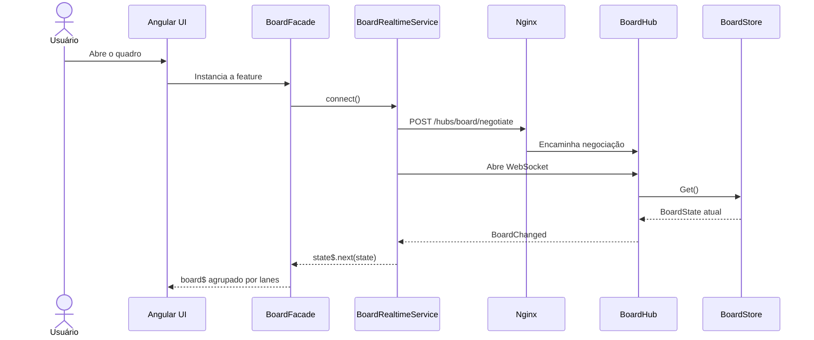
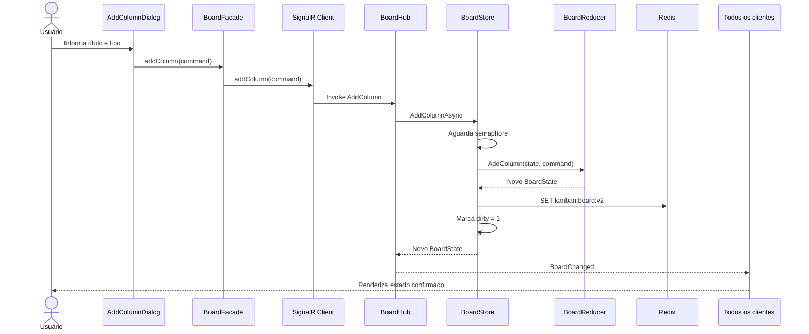
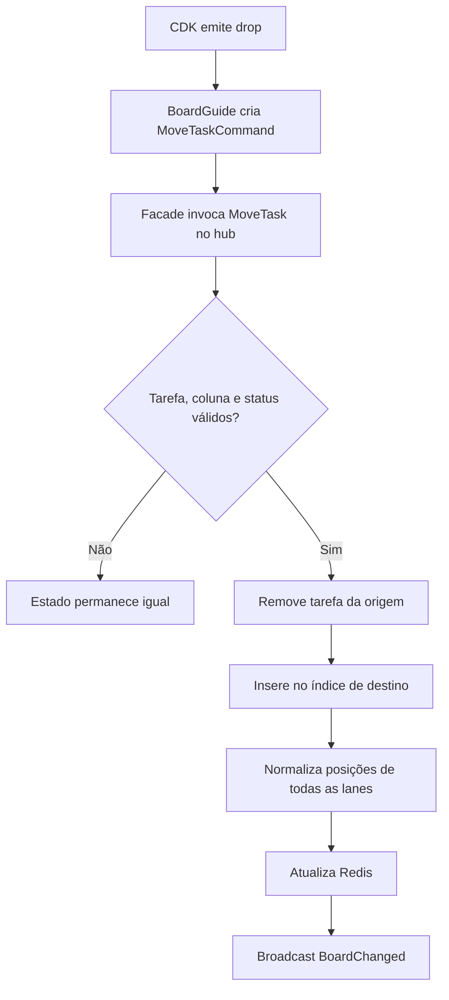
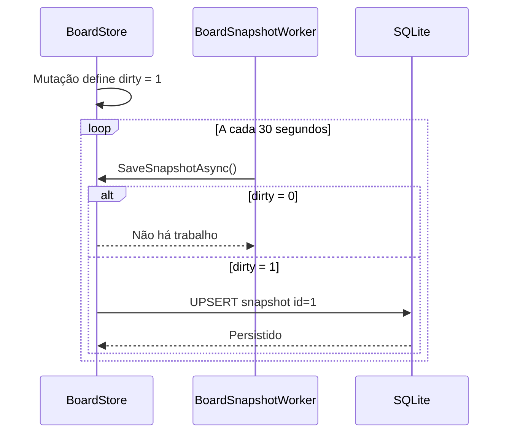
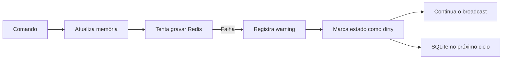

# Fluxos da aplicação

Este documento acompanha uma ação desde a interface até a persistência e descreve como a aplicação se recupera de conexões interrompidas.

## Conexão inicial



A requisição `negotiate` é um `POST` interno do SignalR. Ela devolve token de conexão e transportes disponíveis; não é uma página destinada a acesso manual por `GET`.

## Criação de uma coluna



O frontend não cria o ID definitivo e não altera o card de forma otimista. A interface muda quando recebe a fotografia confirmada pelo servidor.

## Criação de tarefa

O caminho é o mesmo da criação de coluna, com validações adicionais no reducer:

1. o título é normalizado com `Trim`;
2. a coluna precisa existir;
3. o status precisa ser `doing` ou `done`;
4. uma coluna `done-only` rejeita tarefas em `doing`;
5. descrições vazias do checklist são descartadas;
6. IDs são gerados na API;
7. a posição é calculada no fim da lane escolhida.

## Drag-and-drop



A normalização garante posições sequenciais `0, 1, 2...` e elimina lacunas deixadas na lane de origem.

## Alteração de checklist

O card emite `taskId`, `itemId` e `completed`. O reducer procura apenas a tarefa e o item correspondentes, preservando coluna, lane e posição. Em seguida, o estado completo segue o fluxo normal de Redis e broadcast.

## Snapshot no SQLite



Se a escrita falhar, a flag `dirty` volta para `1`, permitindo nova tentativa no próximo ciclo. Um encerramento normal também solicita um snapshot final.

## Redis indisponível



O `RedisBoardCache` trata a falha internamente. A indisponibilidade do Redis reduz a durabilidade imediata, mas não bloqueia o uso do quadro.

## Reconexão do navegador

O cliente SignalR usa `withAutomaticReconnect()`. Quando a conexão é restabelecida, o servidor executa `OnConnectedAsync` novamente e envia o estado atual ao cliente. A fotografia recebida substitui qualquer estado visual antigo.

Se a conexão inicial falhar antes de ser estabelecida, o serviço agenda uma nova chamada a `connect()` após três segundos.

## Reinicialização da API

1. A API cria o diretório e a tabela do SQLite, se necessário.
2. Tenta ler `kanban:board:v2` do Redis.
3. Se encontrar, usa esse valor como estado atual.
4. Caso contrário, procura o snapshot no SQLite.
5. Se encontrar SQLite, carrega o estado e reaquece o Redis.
6. Sem nenhuma fonte persistida, inicia com schema v2 vazio.

## Encerramento e remoção do ambiente

`npm run dev:down` remove containers e rede, mas preserva os volumes nomeados. Um próximo `npm run dev` recupera os dados.

Para remover também os dados, use conscientemente:

```bash
docker compose down --volumes
```

Esse último comando apaga tanto o estado persistido pelo Redis quanto o arquivo SQLite do volume da API.
